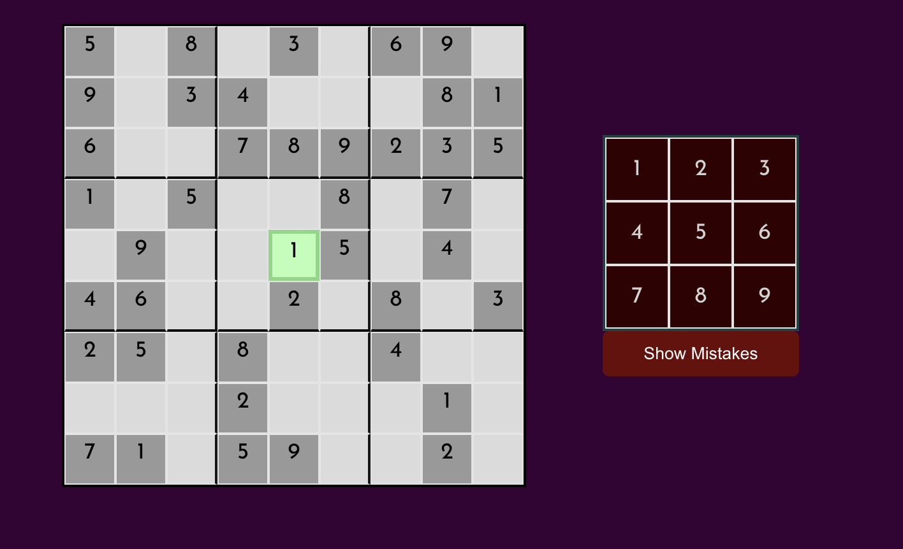
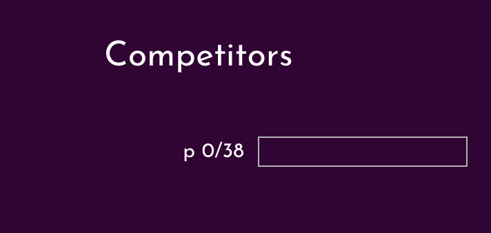
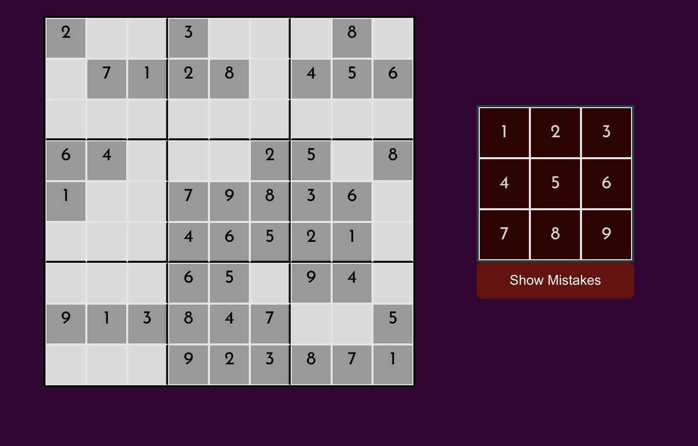

# Multiplayer Sudoku

A real-time multiplayer Sudoku game where players compete to solve the same puzzle simultaneously.

**Live app:** https://mt-suduko-front-4kl8sgqpk-pranitauppalapatis-projects.vercel.app

## Screenshots








## Project Structure

This is a monorepo containing both the frontend and backend:

```
├── frontend/    # React app (Redux, Socket.io-client)
├── backend/     # Node.js server (Express, Socket.io)
└── package.json # Root scripts to run both
```

## Tech Stack

**Frontend**
- React 17 + Redux Toolkit
- Socket.io-client
- React Router DOM
- SCSS Modules

**Backend**
- Node.js + Express
- Socket.io
- Child processes for parallel Sudoku validation

## Getting Started

### Prerequisites
- Node.js 12+
- npm

### Install dependencies

```bash
npm run install:all
```

### Run locally

```bash
npm start
```

This runs the frontend (port 3000) and backend (port 3001) concurrently.

Or run them separately:

```bash
npm run frontend   # React dev server on port 3000
npm run backend    # Node server on port 3001
```

## How It Works

1. Players enter their name to join a game room
2. A countdown starts once the first player joins (30s in production, 5s in development)
3. All players receive the same Sudoku puzzle when the game starts
4. Players race to fill in the correct numbers
5. Live progress bars show competitors' completion in real-time
6. Finished players and their completion times are displayed on the side

## Deployment

### Backend — Render

1. Go to [render.com](https://render.com) and create a new account (or log in)
2. Click **New > Web Service** → connect your GitHub repo
3. Render will auto-detect `render.yaml` and configure the service
4. Deploy — copy the URL it gives you (e.g. `https://sudoku-backend.onrender.com`)

### Frontend — Vercel

1. Go to [vercel.com](https://vercel.com) and import this GitHub repo
2. Vercel will auto-detect `vercel.json` for build settings
3. Add an environment variable:
   - Key: `REACT_APP_BACKEND_URL`
   - Value: your Render backend URL from above
4. Deploy

### Environment Variables

Copy `.env.example` to `frontend/.env` for local development:

```bash
cp .env.example frontend/.env
# Edit frontend/.env and set REACT_APP_BACKEND_URL if needed
```
